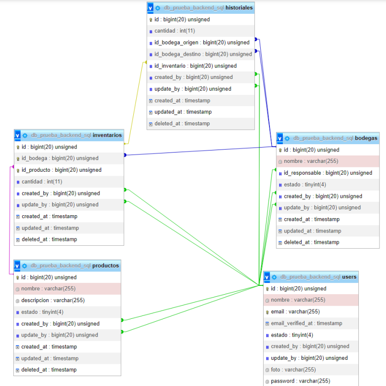

# MongoDB Bodegas

Este proyecto tiene como objetivo desarrollar un sistema de administración de bodegas usando temas tales como:

1. Consultas MongoDb Avanzadas
2. Autenticacion/Autorizacion con JWT 
3. Validacion de colecciones
4. Validacion con DTO
5. Endpoints como servicios

## Funcionalidades principales

El sistema de administración de las bodegas cuenta con 

**1. Gestión de Bodegas**

**2. Gestión de Productos**
 
**3. Gestión de Inventarios:**

     
## Tecnologías utilizadas

El proyecto  utilizará las siguientes tecnologías:

- Lenguaje de programación: [JavaScript](https://developer.mozilla.org/es/docs/Web/JavaScript)
- Framework Backend: [Node.js](https://nodejs.org/)
- Base de datos: [MongoDB](https://www.mongodb.com/es)
- Framework: [Express.js](https://expressjs.com/)

## Diagrama Base de Datos


## Configuración

### Instalación

1. Clona este repositorio en tu máquina local:

   ```shell
   git clone https://github.com/tu-usuario/nombre-del-proyecto.git
   ```

2. Navega hasta el directorio del proyecto:

   ```shell
   cd nombre-del-proyecto
   ```
3. Instala las dependencias del proyecto:

   ```shell
   npm i
   ```
4. Transpila los DTO Typescript
    ```shell
        npm run tsc
    ```
5. Crea las colecciones Mongo usando la extension MongoDB for VSCO

    ```shell
   [Archivo DB](src/db/bodegas.mongodb)
    ```
6. Inicia el servidor mediante el comando `npm run dev`.


### ENV
Antes de ejecutar la aplicación, asegúrate de crear y configurar el archivo de entorno (`.env`) con la siguiente estructura y reemplazar los valores por los adecuados:
```plaintext 
1. Configuración general server
SERVER = {"hostname": "localhost", "port": 8090}

2. Conexión a la base de datos
ATLAS_USER = "angelvelasco"
ATLAS_PASSWORD = ""
ATLAS_DB = "db_campus_bodegas"

3.Clave privada 
JWT_SECRET = "ANGEL"
```

### Dependencias

El proyecto utiliza las siguientes dependencias:

- dotenv (v16.3.1)
- express (v4.18.2)
- jose (v4.14.4)
- class-transformer (v0.5.1)
- class-validator (v0.14.0)
- mongodb (v5.8.1)
- nodemon (v3.0.1)
- reflect-metadata (v0.1.13)
- typescript (v5.1.6)
- express-rate-limit (v6.9.0)

## Endpoints Principales

> ⚠️ **Importante:**
> Las consultas deben poseer en su body columnas referentes al endpoint, con valores logicos en cada campo para que la validacion del DTO sea correcta. (Puedes copiar los valores json dados como ejemplo).

### 1. JWT

### `create`

Este endpoint se utiliza para crear un nuevo cliente en la base de datos y generar un JWT para autenticación en la coleccion definida.

- Método: **GET**
- URL: `http://localhost:8090/app/token/:collection_name`
- Agregega este Token como un Header de tipo Authorization
> ⚠️ **Importante:**
> Guarda el token generado, lo necesitaras para ser autenticado en el login y ser autorizado a realizar diferentes acciones propias de la coleccion.

### 2. Bodegas

###  `look`
Nos permitira obtener todas las bodegas ordenadas ascendentemente por su nombre.

- Método: **GET**
- URL: `http://localhost:8090/bodegas/look`

🔔 **Listo:**
Obtendras todas las bodegas ordenadas.

###  `create`
Podremos crear una bodega nueva

- Método: **POST**
- URL: `http://localhost:8090/bodegas/create`
-  Cuerpo de la solicitud
  ```json
  {
    "id": 10,
    "nombre": "American Express",
    "id_responsable": 4,
    "estado": 1
  }
  ```
> 📌  **Nota:**
> Si la bodega ya existe mostrara un error 409 de conflicto de existencia.


## Autor

**Angel David Velasco**

## Licencia

Este proyecto está bajo la Licencia ISC. 
